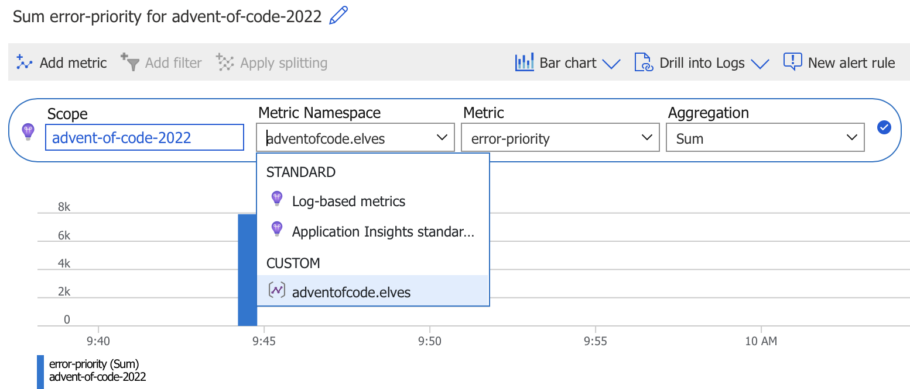
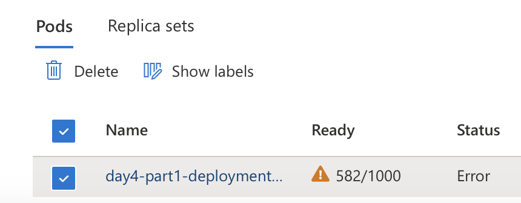
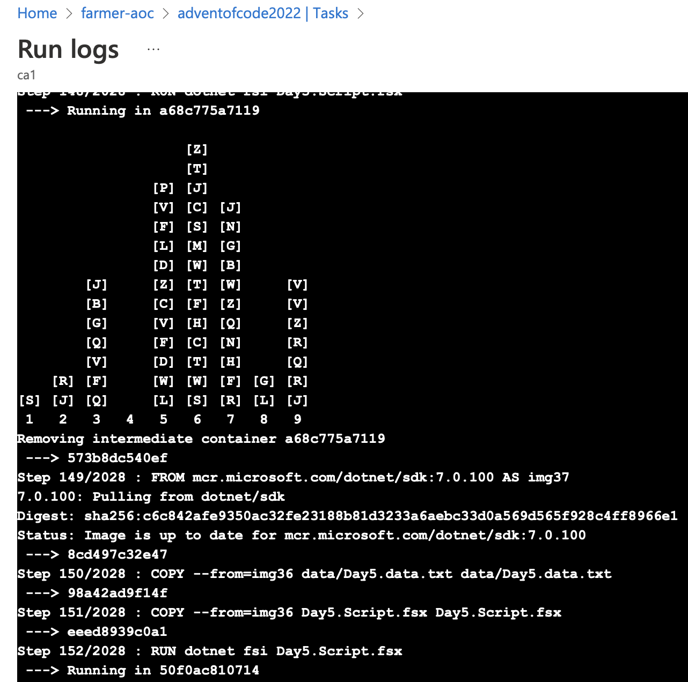
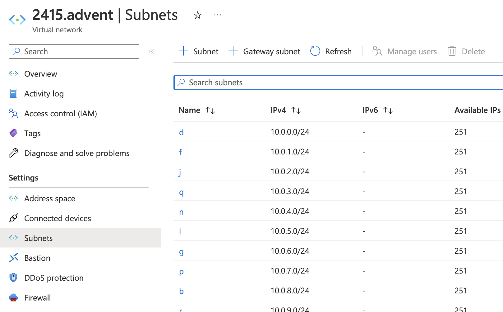

Advent of Code 2022
========

_Farmer Edition_

I may regret this, but for this year's Advent of Code, I'm attempting to solve the problems using Farmer and deploying various cloud resources to solve the problem each day. This may go downhill really fast.

To try these on your own, you'll need to copy your input data to a "data" subfolder, named for each day. For example, the input data for day 1 goes to `data/Day1.data.txt`. Then you can solve Day1 with `dotnet fsi Day1.fsx`. You will also need an Azure subscription to try these out, although in most cases you can replace `Farmer.Deploy.execute` with `Farmer.Writer.quickWrite` to just generate an ARM deployment file.

### Day 1
I'll need to process each row from a file, which sounds like a job for quick little container instances (each is an elf). But I don't want to run a ton of them or I'll hit my quota and cost a lot of money. Since the file is static, I'm going to embed it in the template to be passed to each container so they don't need to deal with any centralized storage.

I'm thinking recursion here because it's Advent of Code and that's what you do. Each container will accept some startup parameters:

* The line of the file they should work with
* The max value so far

The container (representing an elf) will read the line in the file. If it's the end of the file, the container will write to a file in the storage account Day1.solution.txt. If it's any other line in the file, it will try to parse the line into a number and compare it with the max value so far that it was passed and pass the maximum of those values to start another container, then run an ARM deployment to deploy a container replacing itself with new values for the line and max value.

This is going to make a lot of ARM deployments. I'm expecting a phone call.

#### Solution
* [Farmer script to generate ARM deployment](Day1.fsx)
* [Shell script (runs in an Azure container)](Day1.sh)

### Day 2
Day 1 took a while to troubleshoot the random issues that can happen redeploying an ACI container 250+ times, and I couldn't think of any ideas for neat Azure tricks, so I just did an F#-only solution for Day2.

#### Solution
* [fsi script](Day2.fsx)

### Day 3
All of these are going to be doing a lot of line by line processing, but doing a container each is really slow and fragile, so I'm going to change this up a bit. This time I'll make a single container, but it will be connected to an Application Insights workspace and use the OpenTelemetry exporter to send the solution for each line as a metric.

The chart shows the metrics, but I'll need to go to the logs to see the exact value.



All the metrics are named "error-priority" so I can aggregate on that. After the metrics come in, I can find the answer with a kusto query:

```
customMetrics
| where timestamp > ago(30m)
| where name == "error-priority"
| summarize sum(value)
```

The second part is roughly the same, but I'm using a new metric name - "badge-priority" - so I can differentiate the metrics from the two parts.

#### Solution
* [Farmer script to generate ARM deployment](Day3.fsx)
* [fsi script that emits OTel metrics](Day3.Script.fsx)
* [fsi script for part 2](Day3.ScriptPart2.fsx)

### Day 4

I'd like to scale out this one in a ridiculous way, so I'm going to make a shell script that can determine if there is overlap in a line and run a container per line. Then I'll sum up the number of healthy containers, which will be the ones that don't have any overlap.

ACI isn't going to cut it because there are 1000 lines in my input and I can only run 60 instances per container group. Kubernetes will let me run a lot of containers in a pod and then show me how many are healthy.

It will require a large AKS deployment YAML with each container getting a different line from my puzzle input, so I'll generate it.



As expected, many of the containers failed. Anywhere the line had overlap would exit, which means the count of running containers is the answer (582 for my input)!

#### Solution
* [fsi script to generate the AKS deployment and embed it in an ARM deployment](Day4.fsx)
* [Part 1 shell script that runs in each AKS container and fails if the ranges fully overlap](Day4.sh)
* [Part 2 shell script that runs in each AKS container and fails if the ranges overlap at all](Day4.Part2.sh)

### Day 5

For this challenge, crates have to be moved from stack to stack while processing each line. I thought it would be neat to make a docker image for each of these lines so that when the image is built, it modifies the stacks based on the state of the prior image by processing that line. Then an image is saved and the next image is based off that new image. There are ~500 lines of input, so this is going to take building a lot of intermediary images, but I think the limits on image are only on the layers in any given image, not the number of intermediary image. It will also be interesting to see how the Azure Container Registry handles building this one. We will see!



This worked pretty well - the ACR build task churned through the Docker image build pretty quickly and you can see it work through the crate stacks by viewing the repository task history. Watching the build logs (ACR Task Run logs) was interesting as it moves the crates around. Since these are intermediate images instead of layers, the final image is perfectly valid (not nearing the 127 layer limit).

#### Solution
* [fsi script to process the crate data and instructions](Day5.Script.fsx)
* [Farmer script to generate Dockerfile and ARM deployment](Day5.fsx)
* [Generated Dockerfile](Day5.Dockerfile)

### Day 6

I need to find the first set of 4 distinct characters in a string. To do this I'm going to make use of a failure mode to weed out duplicates. I'll create a DNS zone for each group of characters, with a record for each character, so I can look in the portal UI and see the list of zones and records in each. The first one with all 4 address records is the "marker" that I need for the solution. A DNS Zone has 2 default records for the NS and SOA records, so I'll look for the first zone with 6 records.

Lots of unexpected problems happened with this one. First the ARM deployment itself was too big:

```json
{"code": "RequestContentTooLarge", "message": "The request content size exceeds the maximum size of 4 MB."}
```

Then it had too many resources:

```json
{"code": "InvalidTemplate", "message": "Deployment template validation failed: 'The number of template resources limit exceeded. Limit: '800' and actual: '2187'. Please see https://aka.ms/arm-template/#resources for usage details.'.", "additionalInfo": [{"type": "TemplateViolation", "info": {"lineNumber": 0, "linePosition": 0, "path": ""}}]}
```

Then I hit the subscription quota limit on DNS Zones:

```
You have 259 zones of 250 allowed.
```

I gave up and looked for a resource that I could make lots of. I switched to deploying virtual networks instead since the quota is 25,000 (and they don't cost anything). I attempted to make a vnet named by the "marker" index for each slice of 14 characters with a subnet named for the 14 characters. If there are duplicate subnets, the vnet deployment fails, so I'll be able to take the first vnet that actually works. I chunked these into deployments with 150 vnets each. I expect all of them will fail because it requires all the resource deployments to succeed, so I'm ignoring the errors since I should eventually get a vnet out of one of the deployments.



#### Solution
* [Farmer script to deploy ARM deployments for each chunk of vnets](Day6.fsx)
